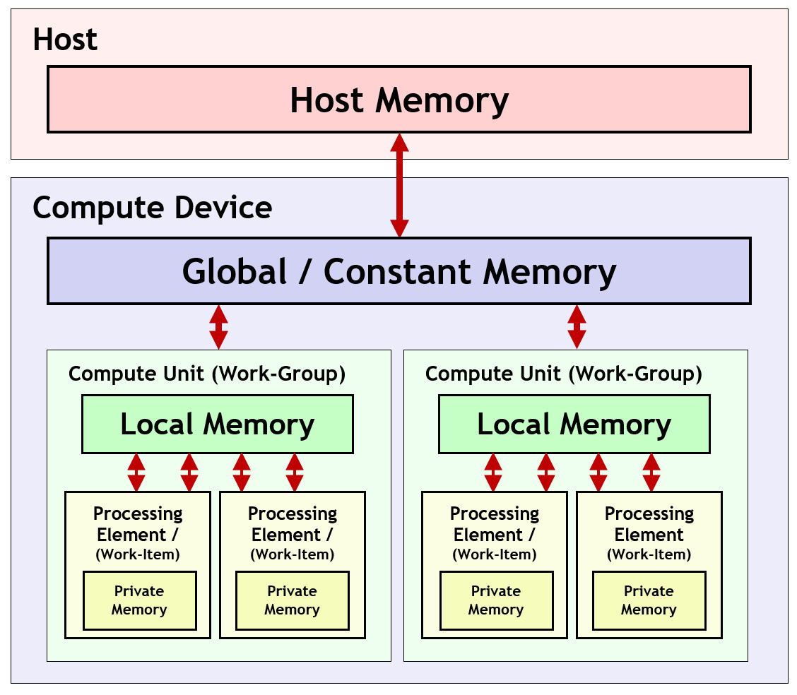

# Programming Assignment 1: Device Query

## Objective

The purpose of this programming assignment is to familiarize the student with the underlying hardware and how it relates to the OpenCL hardware model.  By extension, the program will familiarize the student with the processing resources at hand along with their capabilities.  By the end of this assignment, one should understand the process of compiling and running code that will be used in subsequent modules.

## Instructions
The file `main.c` queries for devices across all platforms, and displays information about each device.

Some properties to pay attention to:

* Computational Capabilities
* Global Memory Size
* Shared Memory Size
* Work Item Size
* Work Item Dimensions
* Work Group Size
* Preferred Work Group Size Multiple

The student is encouraged to relate the device-specific information to the OpenCL memory model, provided below.

_Credits: Khronos Group_

## How to Run

The `main.c` file contains the host code for the programming assignment; there is no associated device kernel code for this assignment. There is a Makefile included which compiles it. It can be run by typing `make` from the DeviceQuery folder. It generates a `device_query` output file.  Simply run this with `./device_query`, which will print device information to the console.

## Submission
Submit the results of this as part of your report.